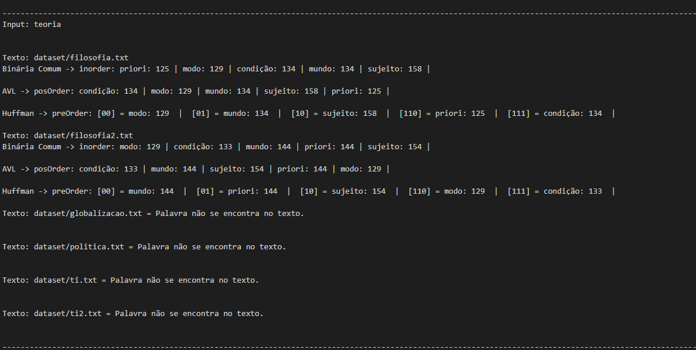
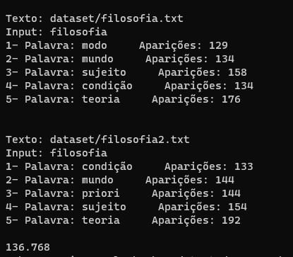

# Sistema de Autocompletar e Sugestões de Palavras
AEDS II | CEFET-MG

<div style="display: inline-block;">    
 
 
</a> 
</div>

<p> </p>
<p> </p>

# Introdução
<p align="justify">

 A proposta do trabalho é formular um sistema de autocompletar e sugestões de palavras, que, quando bem projetados e implementados, podem aumentar significativamente a eficiência e a usabilidade de aplicativos, mecanismos de busca e várias outras interfaces digitais. Nesse contexto, este trabalho se propõe a explorar a concepção e a implementação de um Sistema de Autocompletar e Sugestões de Palavras com base na estrutura da árvore binária.
 
 A essência deste projeto reside na criação de um sistema inteligente capaz de antecipar e oferecer sugestões de palavras relevantes enquanto o usuário digita ou busca informações. Para atingir esse objetivo, o trabalho se divide em quatro etapas distintas e interconectadas.

 - Passo 1: Coleta de Dados: O processo inicia-se com a coleta de dados, onde os usuários fornecem um arquivo denominado "input.data" contendo uma lista de palavras. Cada termo nesse arquivo será considerado como uma palavra-chave a ser pesquisada pelo sistema.

 - Passo 2: Modelo de Dados - Árvores Binárias: Nossa abordagem para construir o Sistema de Autocompletar e Sugestões de Palavras baseia-se no uso de árvores binárias. Essas árvores serão construídas a partir de textos previamente fornecidos, disponíveis na pasta `dataset`. O propósito é estabelecer uma conexão significativa entre as palavras presentes nos textos e as palavras-chave fornecidas pelos usuários.

 - Passo 3: Sugestões de Palavras Relevantes: A terceira etapa envolve a geração de sugestões de palavras relevantes para cada palavra-chave presente no arquivo "input.data". Para isso, percorreremos as árvores binárias, identificando as palavras mais relevantes e próximas às palavras de pesquisa. Aqui, daremos prioridade a palavras frequentes e associadas aos termos de pesquisa, garantindo que as sugestões sejam verdadeiramente úteis para o usuário.

 - Passo 4: Resultados e Análises: Os resultados deste projeto serão apresentados em um arquivo chamado "output.data". Este arquivo conterá informações valiosas sobre as relações entre as palavras pesquisadas e os textos originais. Além disso, a relevância de cada palavra sugerida será calculada com base em sua frequência nos textos.

 ### Abordagem de Implementação

 Para garantir uma análise abrangente das diferentes implementações das árvores binárias e sua influência no Sistema de Autocompletar e Sugestões de Palavras, adotaremos três abordagens distintas:

 - 1: Árvore Binária Padrão: Implementaremos uma árvore binária tradicional, priorizando as palavras mais relevantes e relacionadas à pesquisa. A relevância de uma palavra será determinada por sua frequência e proximidade às palavras-chave de pesquisa.

 - 2: Codificação de Huffman: Exploraremos o uso do código de Huffman para otimizar a estrutura da árvore binária padrão. Calcularemos códigos para cada palavra e reorganizaremos a estrutura da árvore com base nesses códigos, avaliando se essa abordagem oferece vantagens em relação à anterior.

 - 3: Árvore AVL: Implementaremos uma árvore AVL e repetiremos o processo de análise, comparando o tempo médio de processamento com as abordagens anteriores.

 Ao concluir esta tarefa, teremos não apenas uma compreensão mais aprofundada das diferentes implementações de árvores binárias, mas também uma avaliação sólida da eficácia de cada abordagem em termos de desempenho e funcionalidade.

# Arquivos                                                     
<p align="justify">

 |  Arquivo                        |   Função                                                                                          |
 | ------------------------------- | ------------------------------------------------------------------------------------------------- |
 |  `main.c`                       | Arquivo principal para iniciar e chamar as funções do código                                      |
 |  `leitura.hpp`                  | Define as funções e as estruturas que foram utilizadas no código                                  |
 |  `leitura.cpp`                  | Contém o escopo de todas as funções que foram utilizadas                                          |
 |  `Binary_Tree.hpp`              | Define as funções e as estruturas que foram utilizadas para a implementação da árvore binária     |
 |  `Binary_Tree.cpp`              | Implementação das funções para funcionamento da árvore binária                                    |
 |  `AVL_Tree.hpp`                 | Define as funções e as estruturas que foram utilizadas para a implementação da AVL                |
 |  `AVL_Tree.cpp`                 | Implementação das funções para funcionamento da árvore AVL                                        |
 |  `Huffman_Tree.hpp`             | Define as funções e as estruturas que foram utilizadas para a implementação da árvore de Huffman  |
 |  `Huffman_Tree.cpp`             | Implementação das funções para funcionamento da árvore de Huffman                                 |
 |  `Tree.hpp`                     | Define as funções onde manipulo as árvores                                                        |
 |  `Tree.cpp`                     | Iplementação das funções para manipulação das árvores                                             |
 | `stopwords.txt`                 | arquivo que contem as stop words                                                                  |
 | `arquivo de leitura .txt`       | arquivo de entrada principal no qual será feita toda a análise                                    |

# Principais Funções

 - `read() - leitura.cpp` - [linhas 47 a 156]: onde ocorre a leitura de todos os arquivos com os textos que se irá pegar as palavras e onde é montada a hash de cada texto, a partir de outra função `insereHash()`;
 - `heap() - leitura.cpp` - [linhas 396 a 437]: onde, a partir da hash criada, é feita a heap com os elementos com mais aparições e onde se chama as funções para montagem das árvores;
 - `CommumBinary() - Tree.cpp` - [linhas 3 a 20]: onde é chamda a função de inserção para montar a árvore e onde é feita o print inordem, manipulção da árvore binária;
 - `AVL() - Tree.cpp` - [linhas 22 a 39]: onde é chamda a função de inserção para montar a árvore e onde é feita o print inordem, manipulção da árvore AVL;
 - `Huffman_T() - Tree.cpp` - [linhas 41 a 54]: onde é chamda a função de inserção para montar a árvore e onde é feita o print inordem, manipulção da árvore de Huffman;

# Estruturas utilizadas

 ### Unordered_map
 O `unordered_map` é um contêiner associativo que armazenam elementos formados pela combinação de um valor-chave e um valor mapeado , e que permitem a recuperação rápida de elementos individuais com base em suas chaves. Em um unordered_map , o valor da chave geralmente é usado para identificar exclusivamente o elemento, enquanto o valor mapeado é um objeto com o conteúdo associado a esta chave . Os tipos de chave e valor mapeado podem ser diferentes. Internamente, os elementos no unordered_map não são classificados em nenhuma ordem específica em relação à sua chave ou valor mapeado, mas organizados em intervalos dependendo de seus valores de hash para permitir acesso rápido a elementos individuais diretamente por seus valores-chave (com uma complexidade de tempo média constante em média).

 Propriedades do contêiner:

 - Associativo: os elementos em contêineres associativos são referenciados por sua chave e não por sua posição absoluta no contêiner.
 - Não ordenado: os contêineres não ordenados organizam seus elementos usando tabelas hash que permitem acesso rápido aos elementos por sua chave.
 - Mapa: cada elemento associa uma chave a um valor mapeado : As chaves têm como objetivo identificar os elementos cujo conteúdo principal é o valor mapeado.
 - Chaves exclusivas: dois elementos no contêiner não podem ter chaves equivalentes.
 - Consciente do alocador: o contêiner usa um objeto alocador para lidar dinamicamente com suas necessidades de armazenamento.

 Inicialização de uma variável `unordered_map` utilizada no código:

 ```
 unordered_map<string, int> Hash;
 ```

 Iteradores para elementos de contêineres unordered_map acessam a chave e o valor mapeado. Para isso, a classe define o que é chamado de value_type , que é uma classe par com seu primeiro valor correspondente à versão const do tipo de chave (parâmetro de template Key) e seu segundo valor correspondente ao valor mapeado (parâmetro de modelo T):

 ```
    typedef pair<const Key, T> value_type;
 ```
 Iteradores de um contêiner unordered_map apontam para elementos deste value_type . Assim, para um iterador chamado que aponta para um elemento de um mapa , sua chave e valor mapeado podem ser acessados ​​respectivamente com:

 ```
    1 unordered_map<Key,T>::iterator it;
    2 (*it).first;             // the key value (of type Key)
    3 (*it).second;            // the mapped value (of type T)
    4 (*it);                   // the "element value" (of type pair<const Key,T>) 
 ```

 Naturalmente, qualquer outro operador de acesso direto, como -> ou [] pode ser utilizado, por exemplo:

 ```
    1 it->first;               // same as (*it).first   (the key value)
    2 it->second;              // same as (*it).second  (the mapped value) 
 ```

 ### Make_heap
 A `make_heap()` reorganiza os elementos no intervalo (first, last) de forma que formem uma pilha. A heap é uma forma de organizar os elementos de um intervalo que permite a recuperação rápida do elemento com o valor mais alto a qualquer momento (com pop_heap), mesmo repetidamente, ao mesmo tempo que permite a inserção rápida de novos elementos (com push_heap). No caso da `make_heap()`, o elemento com maior valor é sempre apontado primeiro. A ordem dos outros elementos depende da implementação específica. Os elementos são comparados usando operador "<", o elemento com o valor mais alto é um elemento para o qual retornaria falso quando comparado a todos os outros elementos do intervalo.

 Exemplo de implementação básica:

 ```
    // range heap example
    #include <iostream>     // std::cout
    #include <algorithm>    // std::make_heap, std::pop_heap, std::push_heap, std::sort_heap
    #include <vector>       // std::vector

    int main () {
    int myints[] = {10,20,30,5,15};
    std::vector<int> v(myints,myints+5);

    std::make_heap (v.begin(),v.end());
    std::cout << "initial max heap   : " << v.front() << '\n';

    std::pop_heap (v.begin(),v.end()); v.pop_back();
    std::cout << "max heap after pop : " << v.front() << '\n';

    v.push_back(99); std::push_heap (v.begin(),v.end());
    std::cout << "max heap after push: " << v.front() << '\n';

    std::sort_heap (v.begin(),v.end());

    std::cout << "final sorted range :";
    for (unsigned i=0; i<v.size(); i++)
        std::cout << ' ' << v[i];

    std::cout << '\n';

    return 0;
    }
 ```

 Saída:
 ``` 
    initial max heap   : 30
    max heap after pop : 20
    max heap after push: 99
    final sorted range : 5 10 15 20 99
 ```

 Sua complexidade é até linear em três vezes a distância(N) entre o primeiro e o último: compara os elementos e potencialmente os troca (ou move) até serem reorganizados como um heap, logo, temos ela como O(3n);

 >Como no trabalho foi especificado que não era necessário a ordenação da heap, a função `sort_heap` não chegou a ser utilizada. 

 ### Árvore Binária Comum

 Uma árvore binária é uma estrutura de dados mais geral do que uma lista encadeada. Aqui está uma definição recursiva do termo: Uma árvore binária sobre um conjunto de objetos é:

 - NULL (esta é a árvore vazia);

 - um objeto seguido de um par ordenado de árvores binárias;

 Cada elemento – célula ou nó – de uma árvore binária consiste em uma chave e três ponteiros. A chave é o item que realmente importa. Três ponteiros simplesmente dão estrutura à árvore: um aponta para o “filho esquerdo” de uma célula, outro para o “filho direito” de uma célula e um terceiro para o “pai” de uma célula. (De acordo com esta definição, uma árvore é uma generalização de uma lista duplamente encadeada.)

No exemplo a seguir, a chave é do tipo int, mas em geral a chave de uma célula pode ser qualquer coisa: um double, uma cadeia de caracteres (string), etc.

 ```
    typedef struct celula *arvore;             
    struct celula 
    {
        arvore pai;
        int    chave;
        arvore esq;
        arvore dir;
    };
 ```
 Cada célula da árvore possui um endereço na memória do computador. Quando se fala em árvores é muito conveniente confundir com o endereço de cada célula. Portanto, se x é um ponteiro para um objeto árvore, dizemos apenas "considere a célula x" em vez de "veja a célula cujo endereço é x". Em particular, é muito conveniente confundir uma árvore com o endereço da sua raiz: em vez de “olhar para a árvore x”, dizemos “olhar para a árvore com a raiz de endereço x”.

 Para que uma estrutura composta por tais células seja uma árvore, devemos ter x->left->pai igual a x (se x->left não for NULL). Da mesma forma, devemos ter x->dir->pai igual a x.

 Todos os três ponteiros podem ter um valor NULL. Se x é o endereço de uma célula e x->pai é NULL, então dizemos que x é o endereço da raiz da árvore. Se x->left e x->right são ambos NULL, então  x é dito ser uma folha  da árvore.

 Se o endereço da raiz de uma árvore for NULL, dizemos que a árvore está vazia.

 Exemplo de uma árvore: 

 ```
              5        
            /   \             
          3       8   
        /   \    /  \ 
       1     4  6    9
      / \        \     
     0   2        7    
 ```

 Temos que a busca em uma árvore binária comum, tem complexidade média de O(log n)

 >É realizada a implementação nos arquivo `Binary_tree.hpp` e `Binary_tree.cpp` para um melhor entendimento, visualizar os códigos. 

 ### AVL

 A Árvore AVL é uma estrutura de dados de árvore binária de busca balanceada que mantém o equilíbrio da árvore automaticamente durante operações de inserção e remoção.
 Uma Árvore AVL é uma árvore binária de busca, o que significa que cada nó possui no máximo dois filhos, e os nós à esquerda têm valores menores do que o nó pai, enquanto os nós à direita têm valores maiores.

 O fator de equilíbrio de um nó em uma Árvore AVL é a diferença entre as alturas das subárvores esquerda e direita. É calculado como:

 ```
 Fator de Equilíbrio = Altura da Subárvore Direita - Altura da Subárvore Esquerda
 ```

 A propriedade fundamental de uma Árvore AVL é que, para cada nó, o fator de equilíbrio deve estar entre -1, 0 e 1. Se o fator de equilíbrio de um nó violar essa propriedade, a árvore estará desequilibrada e exigirá operações de reequilíbrio.

 Ao inserir um elemento em uma Árvore AVL, a árvore verifica e reequilibra automaticamente, se necessário, para manter a propriedade de balanceamento.
 Ao remover um elemento em uma Árvore AVL, a árvore verifica e reequilibra automaticamente, se necessário, para manter a propriedade de balanceamento.
 A busca em uma Árvore AVL segue o mesmo princípio que a busca em uma Árvore Binária de Busca, com uma complexidade média de O(log n), onde 'n' é o número de elementos na árvore.

 As operações básicas em uma Árvore AVL (inserção, remoção e busca) têm uma complexidade de tempo média de O(log n), tornando-a eficiente para a maioria das operações.

 Exemplo de implementação em pseudocódigo: 

 ```
 Estrutura NóAVL:
    Valor
    NóAVL Esquerda
    NóAVL Direita
    Inteiro FatorDeEquilíbrio

Função InserirAVL(raiz, valor):
    Se raiz for nula:
        Crie um novo nó com o valor e fator de equilíbrio 0
        Retorne o novo nó
    Se valor < raiz.Valor:
        raiz.Esquerda = InserirAVL(raiz.Esquerda, valor)
    Senão, se valor > raiz.Valor:
        raiz.Direita = InserirAVL(raiz.Direita, valor)
    Atualize o fator de equilíbrio e faça rotações, se necessário
    Retorne a raiz atualizada

# Implementar operações de remoção e busca
 ```

 >É realizada a implementação nos arquivo `AVL_tree.hpp` e `AVL_tree.cpp` para um melhor entendimento, visualizar os códigos. 

 ### Huffman    

 Uma Árvore de Huffman é uma árvore binária especial em que os caracteres são armazenados nas folhas da árvore e os nós internos não representam caracteres reais. Cada caminho da raiz a uma folha gera o código binário exclusivo para um caractere.

 Para construir a Árvore de Huffman, inicie criando um nó para cada caractere presente nos dados, atribuindo a frequência desse caractere como seu valor.

 Crie uma fila de prioridade (min-heap) usando os nós dos caracteres com base em suas frequências. Os nós com as menores frequências terão prioridade mais alta na fila.

 Para a contruçã oda árvore é necessário os seguintes passos: 

 - Retire os dois nós de maior prioridade (menor frequência) da fila.
 - Crie um novo nó pai com uma frequência igual à soma das frequências dos dois nós retirados.
 - Adicione o novo nó à fila de prioridade.
 - O último nó restante na fila será a raiz da Árvore de Huffman.

 Após construir a Árvore de Huffman, cada caractere pode ser representado por um código binário exclusivo, seguindo o caminho da raiz até a folha correspondente na árvore. Caracteres frequentes terão códigos mais curtos, o que contribui para a compressão.

 Exemplo de implementação em pseudocódigo: 

 ```
    Estrutura NodoHuffman:
        Caractere
        Frequência
        Esquerda
        Direita

    Função ConstruirArvoreHuffman(dados):
        Crie um nó para cada caractere em dados com frequência igual à sua contagem
        Crie uma fila de prioridade com os nós de caracteres
        Enquanto houver mais de um nó na fila:
            Retire os dois nós de maior prioridade da fila
            Crie um novo nó pai com frequência igual à soma das frequências dos dois nós retirados
            Adicione o novo nó à fila
        A raiz da árvore é o único nó restante na fila

    Função CodificarCaractere(caractere, árvore):
        Siga o caminho da raiz até a folha correspondente a 'caractere' na árvore
        Registre os bits encontrados no caminho

    # Implementar funções para codificação e decodificação
 ```

 A complexidade da Estruta em Árvore com Huffman, depende da implementação, mas de forma geral, é encontrada na literatura como O(n). 

# Lógica Implementada
<p align="justify">

 O arquivo principal, `main.cpp`, inicializa o tempo de execução, chama a função `Principal()` e marca o tempo ao fim do programa, respectivamente. A função `Principal` definida no `leitura.hpp` e trabalhada no `leitura.cpp`. Nela, é realizada a abertura do arquivo de output, definido o vector com os arquivos que serão lidos, e um vetor com as palavras pego no arquivo de input, por fim é chamada a função `read()` dentro de um for que vai até o fim de vetor de input. 

 Na função `read()` a primeira coisa a ser feita é a declaração da principal estrutura de dados utilizada no algoritmno, no caso a estrutrura `unordered_map`. Essa estrura vai armazenar todas as infomações para ser jogada na Heap posteriormente. Para a contrução da Heap foi utilizada a função `make_heap()` presente na biblioteca stl do C++, que é realizada com a chamada da função `heap()` após a contrução da hash, que é feita com cada texto separadamente, apagando a do texto anterior. Vale ressaltar que, a função `heap()` só sera chamada se, e somente se, existir a palavra do input no texto.  

 Neste trabalho também é realizada a remoção de pontuações, stopwords e demais caracteres considerados "estranhos".

 |          Sinais de pontuação     | Stop words                                      |
 |----------------------------------|-------------------------------------------------|
 | `.`, `!`, `?`, `.`, `,`, `...`   |   `artigos(a, o, as,os) ou conjunções(e, ou) `  |

 Dentro da função `heap` é contruída a heap a partir da hash, em seguida, é chamada as funções `ComumBinary()`, `AVL()` e `Huffman()` para a contrução de cada árvore respectivamente. Em ambas as funções, é contruída a árvore, e logo em seguida é utilizada a função de print para jogar os elementos na árvore. 


 > É possível obter qualquer K valor dos itens, apenas mudando o valore <i>5</i> que está presentes dentro da função `heap()` para o valor desejado, é o for da linha 401. 

 <p> </p>

# Exemplo de Sáida

 Para a saída é feito um arquivo chamado `output.data` que será criado na pasta `dataset`. Quando o código é rodado novamente, um novo output será criado em cima do antigo que ja existia. Nele é mostrado o input em questão, o texto referente, o print das árvores, Binária Comum em inOrder mostrando palavra e frequência, AVL em posOrder mostrando palavra e frequência e Huffman em preOrder mostrando código, palavra e frequência:

 <p align="center">
 
 </p>

É possível visualizar que, quando a palavra do input não se encontra em algum dos textos, não é realizada a criação das árvores, que foi uma das regras aplicadas ao trabalho.

No terminal é mostrado o arquito de texto, o input e as palavras que estão na heap com suas respectivas frequências. No fim, é mostrado o tempo de execução do código:

<p align="center">
 
 </p>

<p> </p>

<p> </p>

# Conclusão
 
 Neste trabalho, abordamos a concepção e implementação de um Sistema de Autocompletar e Sugestões de Palavras com base na estrutura da árvore binária. O objetivo principal deste projeto foi criar um sistema inteligente capaz de antecipar e oferecer sugestões de palavras relevantes aos usuários, melhorando significativamente a eficiência e a usabilidade de aplicativos e mecanismos de busca, no caso as árvores binárias.

 ## Binária Comum
 Vantagens:
 - Simplicidade: Uma árvore binária comum é fácil de entender e implementar, o que a torna uma boa escolha para cenários onde a simplicidade é priorizada.

 - Inserção Eficiente: A inserção de elementos em uma árvore binária comum são operações relativamente eficientes, especialmente em comparação com árvores balanceadas mais complexas.

 - Estrutura de Base: As árvores binárias são usadas como base para muitas outras estruturas de dados, como árvores de busca binária, árvores de expressão, e árvores de análise sintática, tornando-as fundamentais para a construção de algoritmos e estruturas de dados mais complexos.

 - Espaço de Armazenamento: As árvores binárias geralmente requerem menos espaço de armazenamento para manter a estrutura em comparação com árvores balanceadas, uma vez que não precisam rastrear informações de balanceamento.

 Desvantagens:
 - Desequilíbrio: Uma árvore binária comum não mantém um equilíbrio automático, o que significa que, dependendo da ordem de inserção, ela pode se degenerar em uma estrutura semelhante a uma lista vinculada, resultando em operações lentas de busca, inserção e remoção.

 - Complexidade Média de Operações: Enquanto as operações de inserção e remoção são eficientes em média, elas podem ser ineficientes em cenários de pior caso, como quando a árvore se torna desequilibrada.

 - Dependência da Ordem de Inserção: A eficiência das operações em uma árvore binária comum depende da ordem em que os elementos são inseridos. Se os elementos forem inseridos em uma ordem que gere uma árvore desequilibrada, as operações podem ser muito lentas.

 - Não é Ideal para Conjuntos de Dados Grandes: Para conjuntos de dados muito grandes, uma árvore binária comum pode não ser a escolha mais eficiente, pois a probabilidade de desequilíbrio aumenta.

 ## AVL
 Vantagens:

- Garante um equilíbrio estrito, mantendo a altura da árvore em níveis logarítmicos.
- Garante um desempenho previsível para operações de busca, inserção.
- Apropriada para uso em casos em que a eficiência é crítica.

 Desvantagens:

- As operações de reequilíbrio podem aumentar a complexidade do código e do desempenho em comparação com árvores binárias de busca simples.
- O espaço extra para armazenar o fator de equilíbrio em cada nó pode ser significativo em grandes árvores.

> Pela literatura, temos que a complexidade da AVL será tanto para busca quanto inserção será O(log n).

## Huffman

Vantagens:

- Eficiente na compressão de dados, especialmente quando caracteres têm frequências diferentes.
- Os códigos são prefixos únicos, tornando a decodificação eficiente.

Limitações:

- O tamanho da Árvore de Huffman precisa ser armazenado junto com os dados para a correta descompressão.
- Pode não ser eficaz em dados já comprimidos ou com frequências uniformes.

 >A complexidade de tempo do algoritmo de Huffman é O(n logn). Podemos observar que usando um heap para armazenar o peso de cada árvore, cada iteração requer O(logn) para determinar o peso menor e inserir o novo peso. Existem O(n) iterações, uma para cada item. Portanto a complexidade é O(n logn), que pode ser o caso do código implementado, já que ele utiliza uma Priority Queue na implementação.


 Para um cenário pequeno e inerte de dados, pela simplicidade a Binária Comum é uma boa opção. Porém para uma frequência alta de repetidos dados, a AVL é uma melhor opção para busca. Para casos de otimização crucial em espaço de armazenamento, o código de Huffman será a melhor opção. 
 
 Concluindo, temos que o trabalho é ótimo para conhecer as estruturas que são as árvores binárias, suas implementações, funcionalidades, vantagens e desvantagens principais nos quesitos tanto de tempo, quanto de espaço. Nos da um leque maior de oportunidades e conhecimentos para aplicações futuras. 
<p> </p>

<p> </p>

# Especificações do Dispositivo utilizado
<p align="justify">

 |                                                                                                                            |
 | -------------------------------------------------------------------------------------------------------------------------- |
 |  `Processador`         -> Intel(R) Core(TM) i7-8565U CPU @ 1.80GHz   1.99 GHz                                              |
 |  `RAM Instalada`       -> 16.0 GB (utilizável: 15.8 GB)                                                                    |
 |  `Tipo de Sistema`     -> Sistema operacional de 64 bits, processador baseado em x64                                       |
 |  `Sistema Operacional` -> Edição Windows 10 Home Single Language, versão 21H2                                              |


<p> </p>

<p> </p>


# Compilação e Execução
<p align="justify">

 Esse pequeno exemplo possui um arquivo Makefile que realiza todo o procedimento de compilação e execução. Para tanto, temos as seguintes diretrizes de execução:


 | Comando                |  Função                                                                                           |
 | -----------------------| ------------------------------------------------------------------------------------------------- |
 |  `make clean`          | Apaga a última compilação realizada contida na pasta build                                        |
 |  `make`                | Executa a compilação do programa utilizando o gcc, e o resultado vai para a pasta build           |
 |  `make run`            | Executa o programa da pasta build após a realização da compilação                                 |
 |  `make c`              | make clean + make + make run (recomendado)                                                        |
 |  `make run`            | make + make run                                                                                   |

<p> </p>

# Contatos

 <div style="display: inline-block;">
 <a href="https://t.me/jmarconia">
  
 </a>
 
 <a href="https://www.linkedin.com/in/jmarconi-almeida/">
 
 </a>

 </div>

 <p> </p>

 <a style="color:black" href="mailto:jmarconiadm@outlook.com?subject=[GitHub]%20Source%20Dynamic%20Lists">
 ✉️ <i>jmarconiadm@outlook.com</i> 
 </a>
